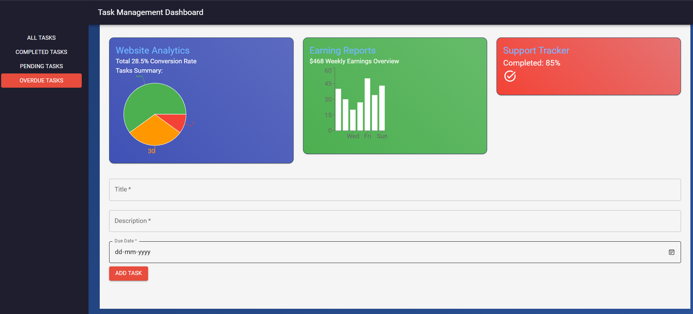

# Task Management Dashboard

This is a **React-Redux Task Management Dashboard** project that allows users to manage tasks efficiently. Users can add, edit, delete, and filter tasks, and view a summary of their task statuses with interactive charts and analytics.




## Features

1. **Task Management**
   - Add new tasks with title, description, and due date.
   - Edit existing tasks.
   - Delete tasks with a confirmation.
   - Mark tasks as completed or pending.

2. **Filters**
   - View tasks based on their status:
     - All Tasks
     - Completed Tasks
     - Pending Tasks
     - Overdue Tasks

3. **Analytics**
   - Pie Chart showing task completion, pending, and overdue statuses.
   - Bar Chart showing weekly earning reports.

4. **UI/UX Design**
   - Responsive design using **Material-UI**.
   - Gradient-based modern design for cards and layouts.
   - Sidebar navigation for filters.

5. **Additional Features**
   - Drag-and-drop reordering of tasks (optional).
   - Search tasks by title (optional).

---

## Technology Stack

- **React**: Front-end framework.
- **Redux**: State management.
- **Material-UI**: UI components and styling.
- **Recharts**: Interactive charts for analytics.

---

## Getting Started

### Prerequisites

Ensure you have the following installed:

- Node.js (>=14.x)
- npm (>=6.x) or yarn (>=1.22)

---

### Installation

1. Clone the repository:
   ```bash
   git clone https://github.com/your-username/task-management-dashboard.git
